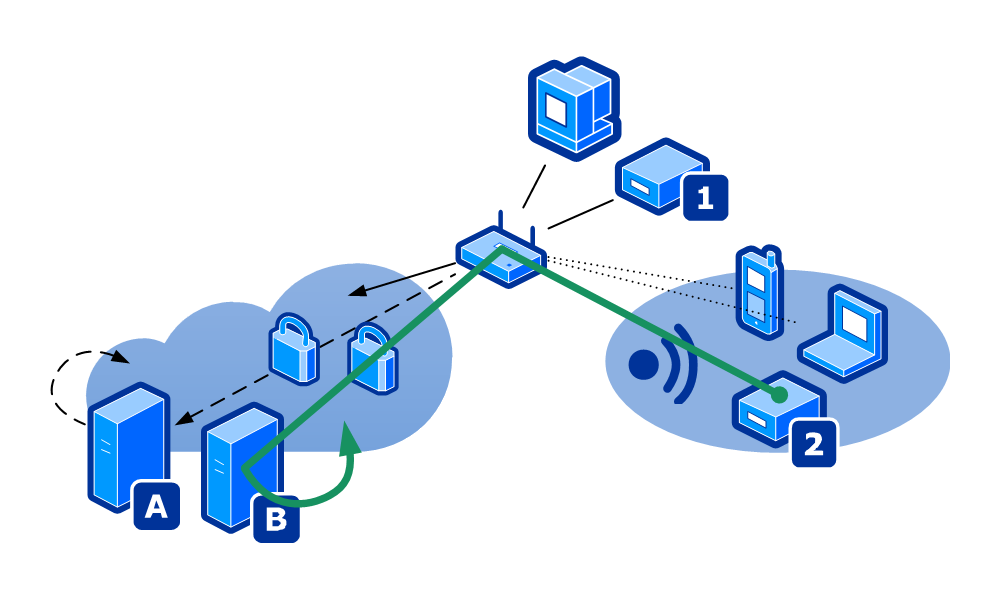

# LEDE OpenVPN Setup Guide

This guide walks you through key points in setting up a router with a custom firmware to route
traffic from a defined local source IP addresses through a VPN to the Internet.


## Intro &ndash; VPN connection

A VPN connection to a server in remote location allows one to overcome geo-blocking
(a form of [discrimination][1], a restriction imposed based place of residence) used by many online
services. This guide focuses on using OpenVPN with a commercial VPN service.

The reason for having a VPN client on the router is that some devices (e.g. media players) don't
support, nor allow installing VPN clients on the device. Having a VPN client on the router to route
all the traffic from the device over a VPN achieves the same effect. I don't want all the traffic
from the local network to be routed over the VPN, so the router must be configured to use VPN
only for defined devices (source IP addresses).

The diagram below illustrates selected devices (1, 2) in local network routed to two VPN servers
(A, B) in remote locations. Other devices in the local network access the Internet directly.
The Internet access from device 2 is highlighted in green. The VPN connections between
the router and the VPN servers are marked with locks.




## Intro &ndash; Router Firmware

A custom firware on a router helps to solve [security issues][2] (such as lack of updates)
often present in consumer routers. In addition, custom firmwares may add advanced features such as
a VPN client. Naturally, there are differences between custom firmware projects.

[Tomato][3] firmware typically has a lot of functionality included without having to install
plugins, and has a nice GUI to configure all settings. However, the Tomato mod that I used did not
receive an update to fix a [security vulnerability][4], the old version of OpenVPN was not
compatible with the VPN service I use, and it would often drop the VPN connection, requiring a
reboot.

[LEDE][5]/[OpenWRT][6] firmware is more complicated to setup requiring installing multiple
packages, and in some cases I found the GUI insufficient, requiring configuring some settings
from the command line. But all the packages are up-to-date and the stability has been excellent
&mdash; not a single reboot has been needed to solve dropped connections or any other errors.

This guide uses the latest available LEDE release at the time of writing: 17.01.4
(released: 18 October 2017). The router is Asus RT-N16. Ensure that yours is compatible
before proceeding. Please refer to the official instructions for [installing LEDE][7].


## Intro &ndash; Document Structure

I kept the instructions pretty brief, and put a bunch of observations into appendices.

Setup steps:
1. [Setup OpenVPN](#setup-openvpn-connection)
2. [Route traffic from a defined source IP](#vpn-policy-based-routing)

Appendices:
1. [Connect to router using SCP](#appendix-1-connect-to-router-using-scp)
2. [OpenVPN options](#appendix-2-openvpn-options)
3. [Eliminate OpenVPN respawn](#appendix-3-eliminate-openvpn-respawn)
4. [Disable IPv6](#appendix-4-disable-ipv6)
5. [Alternative: one-armed router](#appendix-5-alternative-one-armed-router)
6. [Alternative: smart DNS](#appendix-6-alternative-smart-dns)
7. [Virtual machines](#appendix-7-virtual-machines)
8. [Misc. further reading](#appendix-8-misc-further-reading)


## Setup OpenVPN Connection

> Enough rope to shoot yourself in the foot

With 123 options to set ([\[1\]](#appendix-2-openvpn-options)), OpenVPN definitely fits the above metaphora. Luckily LEDE
comes to help &mdash; or does it?

LEDE offers two options to create OpenVPN connection:
1. rename your `*.opvn` to `*.conf` and place the file to `/etc/openvpn/`
2. create setup explicitly using the GUI

We'll explore them both below.

<!-- github markdown doesn't define any admonitions, such as warnings or tip boxes -->
<!-- github filters out "style" attribute: https://stackoverflow.com/q/44831505 -->
<!-- though github filter would pass through "color" attribute, it's not supported in HTML5 -->
<!-- but github seems to support emojis: https://gist.github.com/rxaviers/7360908 -->
<!-- in worst case fall back to unicode... warning sign: &#x26a0; -->
:warning: **Note:** The connection details vary depending on your service provider.
You may be able to save some time using [OpenVPN client setup for various VPN providers][8b].


### Install Required Packages

As a pre-requisite for the following steps, install the following packages using web GUI
(System > Software) or commandline (`opkg install`):

```
openvpn-openssl
luci-app-openvpn
ipset
resolveip
```


### Using OVPN file

The first approach is to use `ovpn` file provided by VPN service. Basically it should be as
simple as renaming your `*.opvn` to `*.conf` and placing the file to `/etc/openvpn/`. While this
works in general, it's not straightforward nor transparent. These are the issues I bumped into:

1. **Loading file requires restarting OpenVPN:**
    ```
    /etc/init.d/openvpn restart
    ```
2. **Web GUI (LuCI) is oblivious to `ovpn` files.** First, there's no indication that the file
was loaded, and second, there's no indication that a new connection was created or has failed.
To get the connection listed on the website, OpenVPN configuration must be updated with a
reference to that file with something like this ([src][24]):
    ```
    package openvpn
    config openvpn 'VPNclient'
    	option enabled '1'
    	option config /etc/openvpn/vpn-provider.ovpn
    ```
3. **If `*.ovpn` does not contain complete setup**, you might get errors in the system log
(on GUI: Status → Systemlog), for example:
    ```
    daemon.err openvpn(xyz-VPN: neither stdin nor stderr are a tty device and you have neither a controlling tty nor systemd - can't ask for 'Enter Auth Username:'.  If you used --daemon, you need to use --askpass to make passphrase-protected keys work, and you can not use --auth-nocache.
    daemon.notice openvpn(xyz-VPN: Exiting due to fatal error
    ```
    This is because the VPN provider expects username and password for authentication, but did not
    have `auth_user_pass` in the `opvn` config file. You can go and fix the `ovpn` file with this
    configuration pointing to a file with your username and password on separate rows.
4. **Trying to recreate the connection:** Every 5 seconds the system tries to re-create this
connection and fails. Despite of trying to stop OpenVPN with the following commands you don't
seem to be able to kill it, and keep on getting the same log spam:
    ```
    /etc/init.d/openvpn stop
    /etc/init.d/openvpn disable
    ```
    To resolve this, reboot the device, fix the error, and enable OpenVPN again. See also
    [Eliminate OpenVPN respawn](#appendix-3-eliminate-openvpn-respawn).


### Create OpenVPN config on GUI

To see if there's a friendlier way of setting up OpenVPN, let's proceed with the second approach
&mdash; create a new connection explicitly using GUI:
1. Create new OpenVPN connection, here named: `xyzvpn`
2. Prepare `auth-user-pass.txt` by storing username and password on their separate rows
3. Upload certificate and key:
    - create directory (through SSH): `mkdir -p /etc/openvpn/keys/xyz-VPN`
    - Upload `ca.crt`, `tls_auth.key` and `auth-user-pass.txt` - see
  [Connect to Router using SCP](#appendix-1-connect-to-router-using-scp).
4. Configure VPN connection using the files - add:
    - VPN/auth_user_pass: `/etc/openvpn/keys/xyz-VPN/auth-user-pass.txt`
    - Cryptography/ca: `/etc/openvpn/keys/xyz-VPN/ca.crt`
    - Cryptography/tls_auth: `/etc/openvpn/keys/xyz-VPN/tls_auth.key`
5. Starting up VPN fails with (on GUI: Status → Systemlog):
    ```
    daemon.err openvpn(xyzvpn)[3477]: Options error: specify only one of --tls-server, --tls-client, or --secret
    ```
    Looking at `less /etc/config/openvpn` reveals unexpected `option secret 'shared-secret.key'`.
    This is not visible nor removable on GUI. Remove from command line:
    ```
    uci delete openvpn.xyzvpn.secret
    uci commit
    ```
6. After this process is startable from the GUI
7. Works fine - look through Status → Systemlog for "Initialization Sequence Completed".
8. Note: trying to stop the process from the GUI respawns the process again. This has
the downside that it doesn't regenerate take actual openvpn config file
(compare `less /etc/config/openvpn` against `less /var/etc/openvpn-xyzvpn.conf`).
Run `/etc/init.d/openvpn restart` to achive this. (See
[Eliminate OpenVPN respawn](#appendix-3-eliminate-openvpn-respawn).)
9. It also complaints about `ifconfig` config entry that can't be removed from the GUI:
    ```
    daemon.warn openvpn(xyzvpn)[12129]: WARNING: using --pull/--client and --ifconfig together is probably not what you want
    ```
    Remove `ifconfig` as above using `uci`.
10. After creating the second OpenVPN connection and restarting the device, the second, new
connection got unintentionally `tun0`, and old `tun1`. Better to fix these in OpenVPN config
field `dev` - instead of `tun` put explicit `tun0` or `tun1`.
11. Despite of the above change, the second OpenVPN connection wouldn't work...
`ifconfig` showing connection details for `tun0` but not for `tun1`, e.g. something like this:
    ```
    inet addr:194.xxx.xxx.xxx  P-t-P:194.xxx.xxx.xxx  Mask:255.255.255.192
    ```
    Trying to fix by adding one extra option for both connections in `/etc/config/openvpn`:
    ```
    option ifconfig_noexec '1'
    ```
    ...and rebooting.  
    → doesn't help.
12. Somewhat confusingly _removing_ the above step fixed the problem, and both `tun0` and `tun1`
work. :confused:


### OpenVPN Recipes

Now that we have a working connection let's copy it to the `openvpn_recipes` so we can easily
create new connections with the same VPN service for example for different geographical regions
just by changing the VPN server name. When copying from `openvpn` to `openvpn_recipes` you need to
change the config group header and set two metadata fields:
```
config openvpn_recipe xyzvpn_client_tun
    option _description "Client configuration for xyz-VPN"
    option _role "client"
```

([src][8], see also [OpenVPN Client Setup for Various VPN Providers][8b])


### Create Interface for OpenVPN Connection

**Create Interface:**
1. Go to Network > Interfaces and run "Add new interface..." and set
    - "Name of the new interface": e.g. xyzvpn_i
    - "Protocol of the new interface": Unmanaged
    - "Cover the following interface": Ethernet Adapter: "tun0"
    - Submit
2. In advanced settings set:
    - "Bring up on boot": ticked
    - "Create / Assign firewall-zone": in "unspecified -or- create" type e.g. `xyzvpn_z`
3. Test - execute (where `tun0` is the virtual network interface of `xyzvpn_i`)
   ([src][9]):
    ```
    ping -c 1 -I tun0 8.8.8.8
    ```

**Set up Firewall:**
1. Go to Network > Firewall and on row **xyzvpn_z** click "Edit" - then set:
    - Input: reject
    - Output: accept
    - Forward: reject
    - Masquerading: tick
    - MSS clamping: tick
    - Allow forward from source zones: lan


## VPN Policy-Based Routing

To redirect traffic from selected source IPs, you can [manually define routing rules][12]. But
this seems very inflexible. Luckily it seems that there are two LEDE extensions that simplify the
setup with a GUI: **mwan3** ([\[1\]][11a], [\[2\]][11b]) and **VPN Policy Routing**. To me the latter
seemed like a better fit and nicer implementation, so I continued with that.

First, we install [VPN Policy-Based Routing][10a]. It is a fresh project and not available on
LEDE repo, so you need to add a [custom repo][10b]. Then [install the extensions][10c].

Next, create a new policy - under "Policies" select "Add" and create a new policy. Here I created
one new policy setup (if you [use a VM to test](#appendix-7-virtual-machines) place here its IP):
```
- Comment:                     vm-test
- Local addresses/devices:     192.168.1.146
- Local ports:                 -
- Remote addresses/domains:    -
- Remote ports:                -
- Interface:                   XYZVPN_I
```

While this setup works for IPv4 services, it leaks the IPv6 address. To fix that you can create
another policy with the IPv6 address in Local Addresses field, and problem solved. But it turns
out that figuring IPv6 address is not always so straight-forward for example for Android devices,
so you may want to [disable IPv6](#appendix-4-disable-ipv6).


## Appendix 1: Connect to router using SCP

LEDE comes with **Dropbear** that "offers SSH network shell access and an integrated SCP server".
To transfer files over SCP use PSCP (putty) with explicit `-scp`.

Download all files from a directory:
```
C:\apps\putty>mkdir c:\tmp\lede1
C:\apps\putty>pscp -scp -r root@192.168.1.1:/etc/config c:\tmp\lede1\
root@192.168.1.1's password:
dhcp                      | 0 kB |   0.7 kB/s | ETA: 00:00:00 | 100%
dropbear                  | 0 kB |   0.1 kB/s | ETA: 00:00:00 | 100%
firewall                  | 4 kB |   4.1 kB/s | ETA: 00:00:00 | 100%
luci                      | 0 kB |   0.7 kB/s | ETA: 00:00:00 | 100%
rpcd                      | 0 kB |   0.1 kB/s | ETA: 00:00:00 | 100%
ucitrack                  | 0 kB |   0.7 kB/s | ETA: 00:00:00 | 100%
uhttpd                    | 0 kB |   0.7 kB/s | ETA: 00:00:00 | 100%
openvpn_recipes           | 2 kB |   2.6 kB/s | ETA: 00:00:00 | 100%
network                   | 0 kB |   0.9 kB/s | ETA: 00:00:00 | 100%
system                    | 0 kB |   0.4 kB/s | ETA: 00:00:00 | 100%
wireless                  | 0 kB |   0.3 kB/s | ETA: 00:00:00 | 100%
openvpn                   | 13 kB |  13.1 kB/s | ETA: 00:00:00 | 100%
```

Upload multiple files (use caret `^` for line continuation in Windows CMD):
```
C:\apps\putty>pscp -scp ^
C:\tmp\lede1\ca.crt ^
C:\tmp\lede1\tls_auth.key ^
C:\tmp\lede1\auth-user-pass.txt ^
root@192.168.1.1:/etc/openvpn/keys/xyz-VPN
root@192.168.1.1's password:
ca.crt                    | 1 kB |   1.6 kB/s | ETA: 00:00:00 | 100%
tls_auth.key              | 0 kB |   0.6 kB/s | ETA: 00:00:00 | 100%
auth-user-pass.txt        | 0 kB |   0.0 kB/s | ETA: 00:00:00 | 100%
```

## Appendix 2: OpenVPN options

There are 123 different options you can configure for an OpenVPN connection.
Queried [man page][13] using jQuery in DevTools:

```
> $('h3:contains(Tunnel Options)').next('dl').find('dt').get().length
123

> $('h3:contains(Tunnel Options)').next('dl').find('dt').text()
--mode m
--local host
--remote host [port] [proto]
--remote-random-hostname
...
```


## Appendix 3: Eliminate OpenVPN respawn

For setup/testing purposes disable automatic restart of OpenVPN. To do this edit `/etc/init.d/openvpn`
with your favorite text editor (LEDE comes with `vi` but you can install also user-friendly `nano`)
([src][8]):
```
nano /etc/init.d/openvpn
```
Comment out the following statements:
```
#    procd_set_param respawn
#    procd_append_param respawn 3600
#    procd_append_param respawn 5
#    procd_append_param respawn -1
```
And restart OpenVPN:
```
root@LEDE:~# /etc/init.d/openvpn restart
```


## Appendix 4: Disable IPv6

Trying to figure out what are the IPv6 addresses of connected devices is difficult. On the Status
page not all IPv6 addresses of connected devices are displayed. Looking into IPv6 addresses with
`ubus call dhcp ipv6leases` gives some more idea but is still inconculsive. Turns out there are
different technologies in play for IPv6 address assignment: Android does not support DHCPv6, but
only SLAAC. "For SLAAC, you cannot assign any particular suffix as such is chosen by the device."
([src][14])

It's presumably easier to switch off IPv6 than to figure out a strategy for redirecting all
intended IPv6 addresses over OpenVPN.

Well switching off IPv6 turns out not to be so easy after all...
1. In Network > Interfaces empty field Global network options > IPv6 ULA-Prefix. ([src][15])  
→ no effect
2. Interfaces>WAN6 and unchecked “bring up on boot.” ([src][16])  
→ no effect; the interface is up and sending and receiving data.
3. Interfaces>LAN>Advanced Settings> Use builtin IPv6-management: tick off  
→ no effect
4. Switch off Network > LAN > DHCP Server > IPv6 Settings ([src][17]):
    ```
    Router Advertisement-Service: server mode            > disabled
    DHCPv6-Service:               server mode            > disabled
    NDP-Proxy:                    disabled               > (leave disabled)
    DHCPv6-Mode:                  stateless + stateful   > (disappears)
    ```
    → works!


## Appendix 5: Alternative: one-armed router

You can put the VPN client onto a separate device, such as **Raspberry Pi**. Raspberry Pi 3
features a single Ethernet port and WiFi, so it would feel natural to set it up to route the
devices connected over WiFi through a VPN tunnel over the Ethernet. However, unfortunately not
all devices have WiFi connectivity.

A "**one-armed router**" (aka "router on a stick") setup enables a single Ethernet port to serve
different logical domains on one physical LAN. The [one-armed router][20] joins two virtual LANs
(VLAN) by forwarding packets between them. Or you can simply [set default gateway][21] on your
device pointing to the one-armed router, which then routes the incoming traffic over a VPN.


## Appendix 6: Alternative: smart DNS

If you only want to access geo-blocked content and the rest of the guide feels too complicated,
you should look into a "Smart DNS" service that routes your trafic through a proxy server in
remote location, effectively achieving what's discussed here, but by hiding all the complexity.


## Appendix 7: Virtual machines

You can use local Virtual Machine (VM) for testing VPN connection, or you can subscribe to a
Virtual Private Server (VPS) in order to host your own VPN server (using for example
[streisand][23]).

If you run a local VirtualBox VM, run it in bridged network mode to get the router to assign it
an IP address (see [VirtualBox - Virtual Networking][22]).


## Appendix 8: Misc. further reading

Tutorials with screenshots:
- [How to setup PureVPN (OpenVPN) on a OpenWRT/LEDE router][25] (2017)
- [Raspberry Pi OpenWRT (LEDE fork - ROOter build) PIA OpenVPN Client][8] (2017)

<!-- markdown reference style links below this line -->

[1]: http://www.europarl.europa.eu/news/en/headlines/economy/20180126STO94142/online-shopping-stopping-geo-blocking-and-country-redirects
[2]: https://routersecurity.org/
[3]: https://en.wikipedia.org/wiki/Tomato_(firmware)
[4]: https://en.wikipedia.org/wiki/KRACK
[5]: https://en.wikipedia.org/wiki/LEDE
[6]: https://en.wikipedia.org/wiki/OpenWrt
[7]: https://openwrt.org/docs/guide-quick-start/factory_installation
[8]: https://www.snbforums.com/threads/raspberry-pi-openwrt-lede-fork-rooter-build-pia-openvpn-client.41024/
[8b]: https://www.snbforums.com/threads/openwrt-lede-fork-rooter-build-openvpn-client-setup-for-various-vpn-providers.41268/
[9]: https://wiki.openwrt.org/doc/howto/mwan3#verify_outbound_traffic_on_each_wan_interface
[10a]: https://github.com/stangri/openwrt-packages/blob/vpn-policy-routing/net/vpn-policy-routing/files/README.md
[10b]: https://github.com/stangri/openwrt-packages/blob/vpn-policy-routing/net/vpn-policy-routing/files/README.md#add-custom-repo-to-your-router
[10c]: https://github.com/stangri/openwrt-packages/blob/vpn-policy-routing/net/vpn-policy-routing/files/README.md#how-to-install
[11a]: https://www.leowkahman.com/2016/06/19/conditional-multiple-openvpn-routing-hostname-ip/
[11b]: https://wiki.openwrt.org/doc/howto/mwan
[12]: https://beenje.github.io/blog/posts/openvpn-source-based-routing/
[13]: https://community.openvpn.net/openvpn/wiki/Openvpn24ManPage
[14]: https://forum.turris.cz/t/ipv6-suffix-for-static-lease/3642/5
[15]: https://superuser.com/questions/1104484/disable-ipv6-with-openwrt
[16]: https://forum.lede-project.org/t/proper-method-to-disable-ipv6-on-lede/7796
[17]: https://forum.turris.cz/t/how-can-i-disable-ipv6/3316/3

[20]: https://www.sbprojects.net/projects/raspberrypi/vlan.php
[21]: https://gist.github.com/superjamie/ac55b6d2c080582a3e64
[22]: https://www.virtualbox.org/manual/ch06.html#networkingmodes
[23]: https://github.com/StreisandEffect/streisand
[24]: https://forum.lede-project.org/t/vpn-provider-ovpn-to-lede-wrt/11522
[25]: http://stitchroads.blogspot.cz/2017/11/how-to-setup-purevpn-openvpn-on.html
